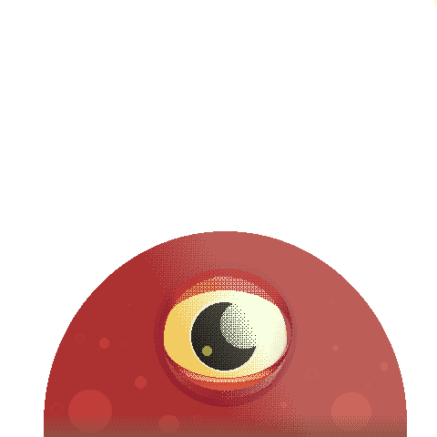
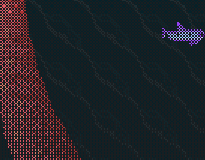
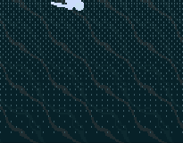
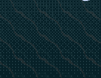
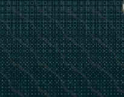
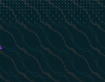

[![Contributors][contributors-shield]][contributors-url]
[![Forks][forks-shield]][forks-url]
[![Stargazers][stars-shield]][stars-url]
[![Issues][issues-shield]][issues-url]
[![LinkedIn][linkedin-shield]][linkedin-url]


<!-- PROJECT LOGO -->
<br />
<p align="center">
  <a href="https://uryelah.github.io/from-the-depths/">
    
  </a>

  <h1 align="center">
    <a href="https://uryelah.github.io/from-the-depths/">
    From the depths...
    </a>
  </h1>

  <p align="center">
    The humans are coming, protect the seabed.
    <br />
    <a href="https://uryelah.github.io/from-the-depths/"><strong>Play it here »</strong></a>
    <br />
    <br />
    <a href="https://github.com/uryelah/from-the-depths/issues">Report Bug</a>
    ·
    <a href="https://github.com/uryelah/from-the-depths/issues">Request Feature</a>
  </p>
</p>


<!-- TABLE OF CONTENTS -->
## Table of Contents

* [About the Project](#about-the-project)
* [How to play](#how-to-play)
* [Characters](#characters)
* [Prerequisites](#prerequisites)
* [Built With](#built-with)
* [Commands](#available-commands)
* [Contact](#contact)
* [Acknowledgements](#acknowledgements)
* [CopyRight/Attributions](#copyRight/Attributions)


## About The Project

**From the depths** consists of a shooter game with the twist that it happens under the sea instead of the in space.

You control an ancient, squid-like, sea creature that has their domains invaded by humans, much to its demise. 

The games object is to get points from eliminating the humans and its machines, while keeping your hp, or health points, above zero.

All the art feature in this game is original if not indicated otherwise at the Attributions section.

**Features**

- Shoot stuff!
- Eat fish!
- Squeeze humans slowly to their death!
- Battle a submarine!
- Wiggle a tentacle around
- Check if your score at the top of the LeaderBoard!

-----

## How to play

[![Product Name Screen Shot][product-screenshot]](https://uryelah.github.io/from-the-depths/)

This game is completelly controlled with your mouse or touch pad.

To start choose your name, it will be used to save your score at the end.

Move your mouse and your character tentacle will follow it.

Click to shoot bubbles at humans and their submarines.

Click and hold to squeeze humans to death or to eat fish and get more hp.

Click and hold while moving your cursor, for less time, to carry a human around.

Avoid human projectiles or carry a dumb humans to use as your shield, good for a maximum of two shots.

Avoid the submarine ray attacks.

The game starts very slow but gets harder and harder with time, so good luck staying alive ;-)

## Characters

### You



What a handsome sea creature!
Sure it has only one tentacle, but hey, no one is perfect.

### Dumb humans

How there them to invade and destroy your home, look at their dumb little legs.



They cause damage if you let them go to the bottom of the screen. Can be squeezed and shot.
These are so dumb that they can be used as meat-shields to protect you from knives. 
Has low hp.

### Armed dumb humans

Look at that, didn't their mother tell them to not play with knives?



They do the same things the regular humans do plus shooting and running away from you.
Has higher hp.

### Submarine

Maybe there are humans inside? Maybe it's controlled remote. Who cares though, it's invading YOUR PROPERTY!
Has very high hp.



Shootable but not squeezable, too much metal. Beaware when it reaches the middle of the screen, it likes to shoot anti-sea-creature rays there.

### Vaquita

Looks at this cute and pure creature, so happy and well in it's little life. We must protect it, but also eat it because the HP won't replenosh itself, not fast enought at least.



They taste like 2-day-old burger king fries.

-----

## Prerequisites

If you want to...

**Play the game online**

Simply access [this link](https://uryelah.github.io/from-the-depths/) and enjoy the game!

**Install the game locally**

1. Make sure you have [node installed](https://nodejs.org/en/download/) in you local environment.

2. Download or clone this repository

3. Navigate to the game root directory in your terminal

4. Install the required packages:
```sh
npm i
```
5. Start the game in your browser:
```sh
npm run start
```

------

### Built With
This project was built mainly with Phaser 3, a HTML5 game framework, and the assorted tools and languages bellow:

* [Phaser 3](https://www.phaser.io/phaser3)
* [HTML](https://developer.mozilla.org/en-US/docs/Web/html)
* [Javascript](https://developer.mozilla.org/en-US/docs/Web/javascript)
* [CSS](https://developer.mozilla.org/en-US/docs/Web/CSS)
* [Webpack](https://webpack.js.org/)
* [Babel](https://babeljs.io/)


## Available Commands

| Command | Description |
|---------|-------------|
| `npm install` | Install project dependencies |
| `npm start` | Build project and open web server running project |
| `npm run build` | Builds code bundle with production settings (minification, uglification, etc..) |

-------

## Contact

Sarah Chamorro - [@your_twitter](https://twitter.com/sarah_chamorro) - sarahchamorro@gmail.com

Project Link: [https://github.com/your_username/repo_name](https://github.com/your_username/repo_name)

-------

## Acknowledgements
* [GitHub Emoji Cheat Sheet](https://www.webpagefx.com/tools/emoji-cheat-sheet)
* [Phaser 3 Webpack Project Template](https://github.com/photonstorm/phaser3-project-template)
* [Freesound.org](https://freesound.org)
* Microverse
* Team 54

## CopyRight/Attributions

This project was only possible thanks to the cretors bellow:

RAPIDPUNCHES - [Vaquita tileset](https://opengameart.org/content/vaquita-porpoise)

Jay - [4-Color Assortment](https://opengameart.org/content/4-color-assortment)

POKOMOKO - [Animated Ocean Water Tile](https://opengameart.org/content/animated-ocean-water-tile)

-------

[contributors-shield]: https://img.shields.io/github/contributors/othneildrew/Best-README-Template.svg?style=flat-square
[contributors-url]: https://github.com/uryelah/from-the-depths/graphs/contributors
[forks-shield]: https://img.shields.io/github/forks/othneildrew/Best-README-Template.svg?style=flat-square
[forks-url]: https://github.com/uryelah/from-the-depths/network/members
[stars-shield]: https://img.shields.io/github/stars/othneildrew/Best-README-Template.svg?style=flat-square
[stars-url]: https://github.com/uryelah/from-the-depths/stargazers
[issues-shield]: https://img.shields.io/github/issues/othneildrew/Best-README-Template.svg?style=flat-square
[issues-url]: https://github.com/uryelah/from-the-depths/issues
[license-shield]: https://img.shields.io/github/license/othneildrew/Best-README-Template.svg?style=flat-square
[license-url]: https://github.com/uryelah/from-the-depths/blob/master/LICENSE.txt
[linkedin-shield]: https://img.shields.io/badge/-LinkedIn-black.svg?style=flat-square&logo=linkedin&colorB=555
[linkedin-url]: https://www.linkedin.com/in/uryelah/
[product-screenshot]: ./assets/gameplay.gif
